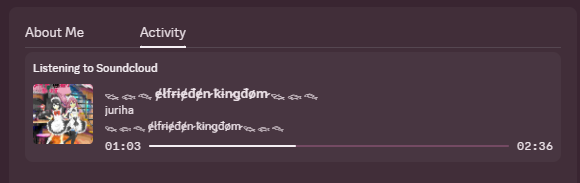

# 🎵 SoundCloud RPC

Display your SoundCloud listening activity on Discord with Rich Presence integration!



## 🚀 Features

### Browser Extension

- Real-time SoundCloud activity tracking with track position/seeking
- Preview Discord presence in extension pop-out
- Easy configuration interface
- Seamless Discord Rich Presence integration
- Support for multiple browsers (Chrome, Firefox, Edge)
- Secure WebSocket communication

### Desktop Application

- System tray integration for easy access (in development)
- Auto-startup capability
- Cross-platform support (Windows & Linux)
- Token-based authentication
- Lightweight and resource-efficient

## 📦 Components

### 1. Web Extension

Located in `/web-extension`

- Tracks your SoundCloud playback
- Communicates with desktop app via WebSocket
- Works on Chromium and Gecko based browsers

### 2. Desktop Application

Located in `/desktop-app`

- Handles Discord RPC integration
- Provides WebSocket server for extension communication
- Manages system tray and configuration (in development)

## 🔧 Installation

### Desktop App

1. Download the latest release
2. Run the application
3. App runs in system tray (in development)
4. First run will prompt for configuration

### Browser Extension

1. Load in developer mode
2. Ensure desktop app is running (default: `ws://localhost:8173`)
3. Play something on SoundCloud

## ⚙️ Configuration

Configure desktop app through `config.json`:

```json
{
  "port": 8173,
  "token": "your-secure-token",
  "discordClientId": "your-discord-client-id"
}
```

## 🛠️ Building from Source

```bash
# Install dependencies
pnpm install

# Start the application
pnpm start

# Build all components
pnpm run build:all
```

## Requirements

- Discord desktop application
- Modern web browser (Chromium/Gecko based)
- Node.js & pnpm (for building)

## License

MIT
